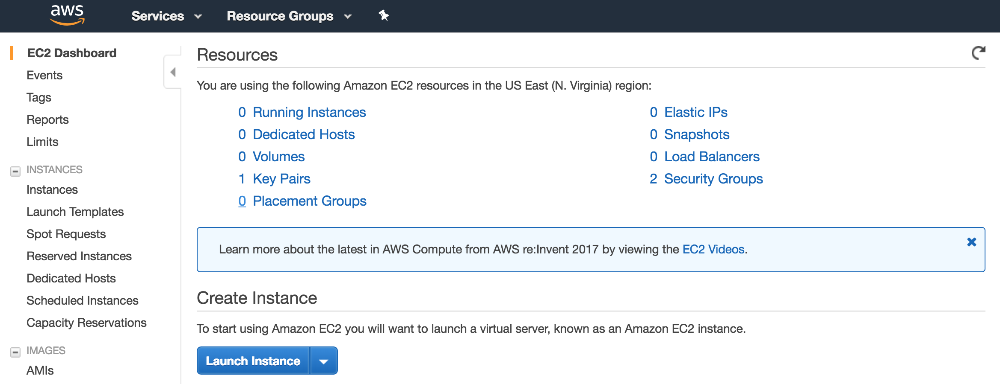
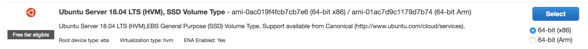
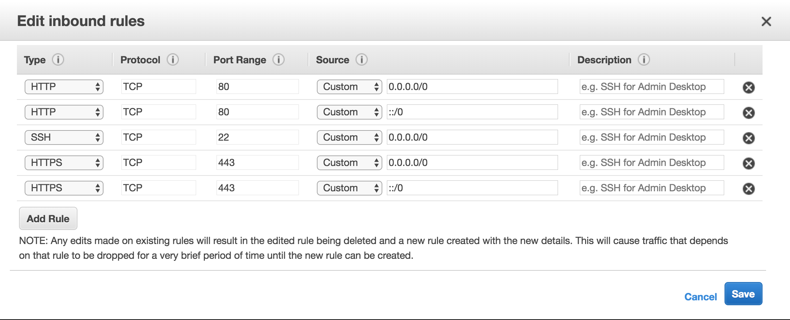
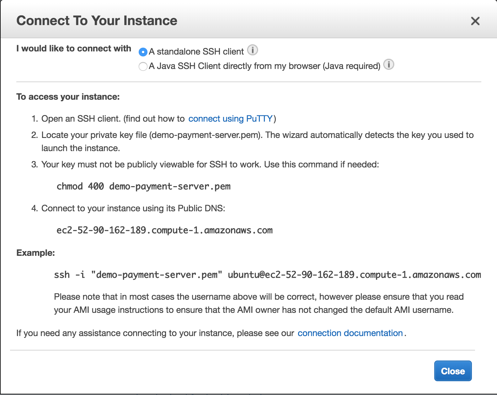

# Launch AWS web server and Setup

1. Log into AWS Console - [Login](https://console.aws.amazon.com/console/home)
2. Navigate to the EC2 Dashboard



3. Launch Instance
4. Select an Ubuntu Server - *Free Tier Eligible*



5. Select t2.micro


6. Select Review and Launch


7. Select Launch


8. Create a new key pair and download the `*.pem` file. Store it in a safe place.


9. Confirm Launch. Once launched you can check the IP in the Instances tab.


10. Change the label on the instance


11. Update AWS permissions in the EC2 security group,



12. On AWS Route53 setup subdomain,


13. `ssh` into the instance using the `*.pem` file



```
$ chmod 400 demo-payment.pem # on computer with pem
$ ssh -i "demo-payment.pem" ubuntu@ec2-35-158-239-92.eu-central-1.compute.amazonaws.com
```

14. Add your ssh key for normal access if you have one.

```
$ ls -al ~/.ssh
$ cat ~/.ssh/id_rsa.pub # on computer with key
```

 * copy the key from your computer and paste it on the server in the
 authorized_keys file.

```
$ vim ~/.ssh/authorized_keys # on server
```

 * exit `ctrl-d` and test accessing the server's global ip address

```
$ ssh ubuntu@35.158.239.92 # test login
```

15. Move to root user and add your key there as well.

```
$ sudo su # on server
$ vim ~/.ssh/authorized_keys # add your key
$ ssh root@35.158.239.92 # test login
```

16. Install docker

```
# apt-get update
# apt-get upgrade
# apt install docker.io
# docker --version # check it installed correctly
# systemctl enable docker # enable docker
```

17. Get the install script, (With newest version number)

```
# curl -LO https://raw.githubusercontent.com/jmbott/demo_payment_server/0.0.1/prod/install.sh
```

18. Update the permissions on the install script

```
# chmod +x install.sh
```

19. Install using the script,

```
# ./install.sh
```
